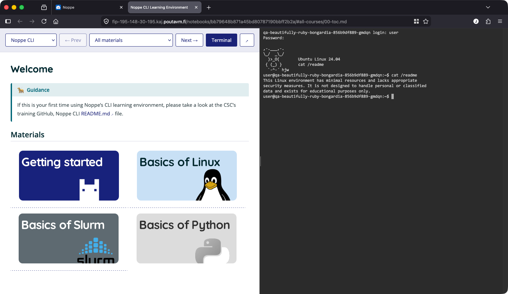

# Noppe CLI Learning Environment

This repository contains the course content for the [Noppe](https://noppe.csc.fi) CLI learning environment application.



## The environment

When you open the application, the browser window is split into two panels:

- **Left panel** - the course material, rendered from Markdown
- **Right panel** - a fully interactive Linux terminal running inside the container

You navigate through chapters using the selectors and Prev/Next buttons at the top of the left panel. The terminal panel can be resized by dragging the divider, hidden with the Terminal button, or opened in its own browser window.

The content in the left panel is loaded from a Git repository. When the application starts in Noppe, the platform clones this repository into the container and the environment serves it automatically. Any template variables in the Markdown files (see below) are substituted with the real values at startup.

## Repository structure

The engine expects the following layout:

```
manifest.json
<topic-id>/
    00-toc.md
    01-<chapter>.md
    02-<chapter>.md
    ...
    imgs/          (optional, for images)
    questions.gift (optional, for quizzes)
```

`manifest.json` at the repository root is the only required configuration file. It lists all topics and their chapters in order:

```json
{
    "topics": [
        {
            "id": "my-topic",
            "title": "My Topic Title",
            "chapters": [
                { "id": "00-toc",  "title": "Table of contents", "file": "00-toc.md"  },
                { "id": "01-intro","title": "1. Introduction",   "file": "01-intro.md" }
            ]
        }
    ]
}
```

- `id` - used in URLs and as the directory name on disk; keep it URL-safe (lowercase, hyphens)
- `title` - displayed in the topic and chapter selectors
- `file` - filename relative to the topic directory

Each topic's Markdown files live in a directory named after the topic `id`. The naming convention `00-toc.md`, `01-*.md`, `02-*.md` is a convention rather than a requirement - the order comes from `manifest.json`.

Images placed in `<topic-id>/imgs/` are served at `/imgs/<filename>` and can be referenced in Markdown as ``.

## Writing content

### Admonition blocks

The renderer supports several named container blocks written with `:::` fences:

```markdown
::: note
This is a plain informational note.
:::

::: tip My custom title
Tips get a custom title by writing it after the type keyword.
:::

::: beware
Use this for warnings the reader should not skip.
:::
```

Available types: `note`, `tip`, `guidance`, `service`, `question`, `beware`.

### Terminal blocks

Use a `:::terminal` block (or a fenced code block tagged `terminal` or `console`) to display a styled terminal snippet in the content panel:

````markdown
::: terminal
user@host:~$ echo "Hello"
Hello
:::
````

Lines beginning with `>` inside terminal blocks are treated as PS2 continuation prompts and are excluded from clipboard copies.

### Quizzes

Interactive quizzes are defined in a `questions.gift` file in the topic directory using [GIFT format](https://docs.moodle.org/en/GIFT_format). Place a quiz widget in Markdown with:

```markdown
::: quiz question-id
:::
```

The engine supports multiple-choice, true/false, and short-answer question types.

### Template variables

The following placeholders are replaced with live values at container startup:

| Variable | Value |
|---|---|
| `{{HOSTNAME}}` | Container hostname |
| `{{USERNAME}}` | Login username |
| `{{PASSWORD}}` | Login password |
| `{{UID}}` | Numeric user ID |
| `{{GID}}` | Numeric primary group ID |

Use them anywhere in your Markdown files, for example in copy-paste commands that include the username or in exercises that reference the hostname.

## Creating your own course

1. Fork or clone this repository (or create a new one with the same structure).
2. Create a directory for your topic, e.g. `my-course/`.
3. Write your Markdown files inside it.
4. Add the topic and its chapters to `manifest.json`.
5. Optionally add `imgs/` for images and `questions.gift` for quizzes.
6. Point a Noppe application at your repository - the environment will serve your content automatically.

The repository can contain multiple topics; all of them appear in the topic selector in the UI.

**Note on repository naming:** the engine image currently expects the content repository to be named `noppe-cli`. If your repository has a different name, the engine needs to be rebuilt with that name updated in one configuration file. See the engine README under *Using a differently-named repository* for instructions.

## Customising the container software

The engine container comes with a range of pre-installed tools including compilers, Python, MPI, Slurm, and OpenStack clients. If your course requires additional software, refer to the engine repository at [github.com/CSCfi/noppe-public-images](https://github.com/CSCfi/noppe-public-images) under the `noppe-learning` directory. The engine's README describes how to extend the OS installation.
